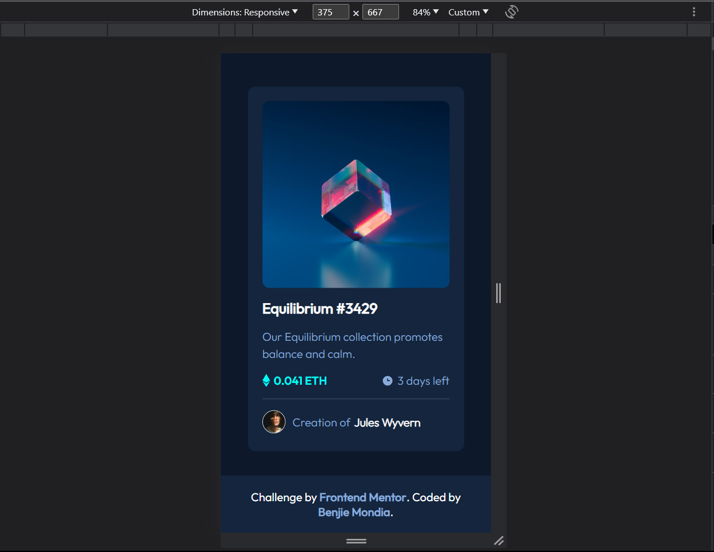
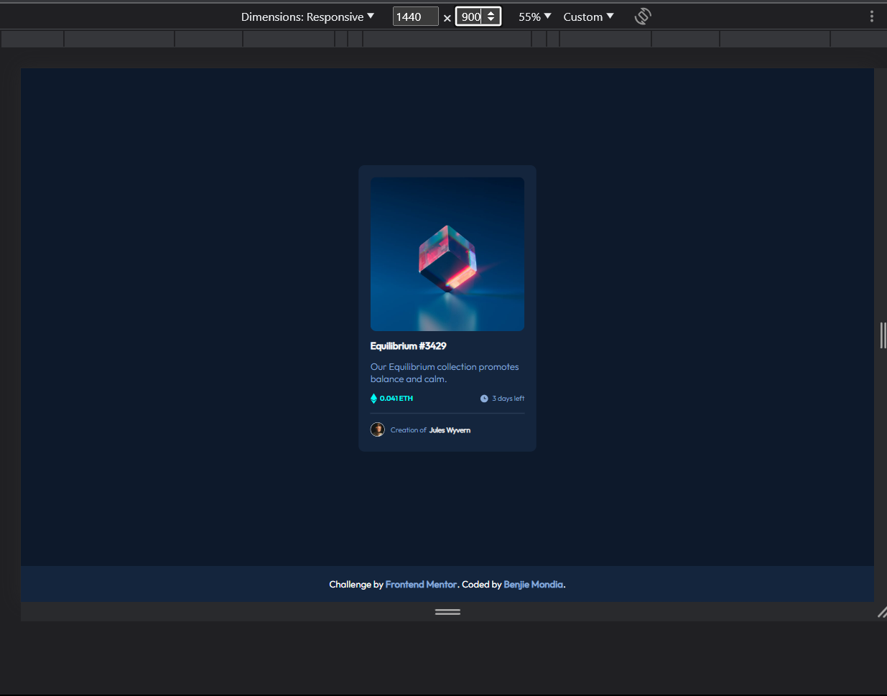

# Frontend Mentor - NFT Preview Card Component

This is my solution to the [NFT Preview Card Component challenge](https://www.frontendmentor.io/challenges/nft-preview-card-component-SbdUL_w0U) on Frontend Mentor. Frontend Mentor challenges are a great way to improve your coding skills by building realistic projects.

## Overview

### The Challenge

The challenge requires users to:

- View the optimal layout depending on their device's screen size.
- See hover states for interactive elements.

### Screenshot

## Links

- [Solution URL](https://your-solution-url.com)
- [Live Site URL](https://your-live-site-url.com)

## My Process

### Built With

- Semantic HTML5 markup
- CSS custom properties
- Flexbox
- CSS Grid

### What I Learned

During this project, I learned:

- How to use semantic HTML5 markup.
- CSS custom properties for flexible styling.
- Implementing responsive layouts with Flexbox and CSS Grid.
- Creating hover states for interactive elements.

### Continued Development

In future projects, I plan to focus on:

- Further improving my CSS skills.
- Exploring advanced JavaScript interactions.
- Enhancing my knowledge of responsive web design.

## Author

- Linkedin - [@BenjieMondia](https://www.linkedin.com/in/benjie-mondia-74a24325b/)
- Frontend Mentor - [@benjamineke](https://www.frontendmentor.io/profile/benjamineke)
- Twitter - [@BenjieMondia](https://twitter.com/BenjieMondia)

## Acknowledgments

I'd like to thank [Frontend Mentor](https://www.frontendmentor.io) for providing this challenging project and the supportive community for their feedback and insights.
